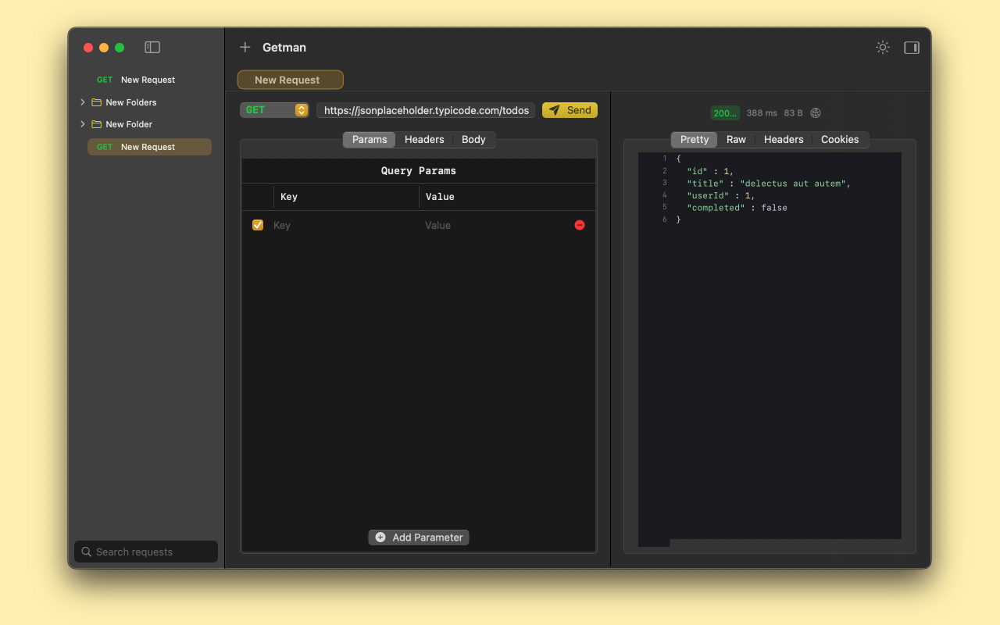

# Getman

Getman is a lightweight HTTP testing client for macOS built with SwiftUI. It provides a clean and simple interface for testing HTTP APIs.

## Features

### Implemented ✅
- [x] Clean and intuitive SwiftUI user interface
- [x] Support for standard HTTP methods (GET, POST, PUT, PATCH, DELETE)
- [x] Request features:
  - [x] Headers management with auto-complete
  - [x] Query parameters editor
  - [x] JSON request body
  - [x] Form data support
- [x] Response viewing:
  - [x] Pretty JSON formatting
  - [x] Raw response view
  - [x] Response headers inspector
  - [x] Cookies viewer
- [x] Request organization:
  - [x] Folder structure
  - [x] Drag and drop support
  - [x] Rename/delete operations
- [x] Response metadata display (status code, time, size)
- [x] Dark/Light mode support
- [x] Horizontal/Vertical layout options

### Planned 🚀
- [ ] Collection management:
  - [ ] Import/Export collections
  - [ ] Share requests
- [ ] Authentication support:
  - [ ] Basic Auth
  - [ ] Bearer Token
  - [ ] OAuth 2.0
- [ ] Advanced features:
  - [ ] Request history
  - [ ] Environment variables
  - [ ] Pre-request scripts
  - [ ] Tests
- [ ] GraphQL support:
  - [ ] Query builder
  - [ ] Schema introspection
- [ ] Developer tools:
  - [ ] Code generation
  - [ ] cURL command export
  - [ ] Response time graphs
- [ ] Local storage:
  - [ ] Request caching
  - [ ] Response history
- [ ] WebSocket support
- [ ] Certificate management
- [ ] Proxy configuration

## Requirements

- macOS 13.0 or later
- Xcode 15.0 or later

## Running the Project

1. Clone the repository
2. Open `getman.xcodeproj` in Xcode
3. Build and run the project

## Screenshots

